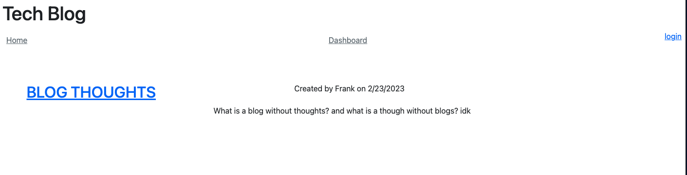

# Tech-Blog 

## Description 

This application allows users to sign in, make blog posts, and comment on blog posts, as well as view other users posts. A dashboard has their own posts as well as allows them to delete the posts. Troubleshooting this project took a lot of time, and through that process it really helped me understand how MVC functions. 

## Installation 

Use "npm i" to install the required packages. 

## Usage 

https://calm-mesa-92926.herokuapp.com/ here is the deployed application on Heroku. Users must sign up to be able to view posts and make their own. 

## License

The MIT License (MIT)